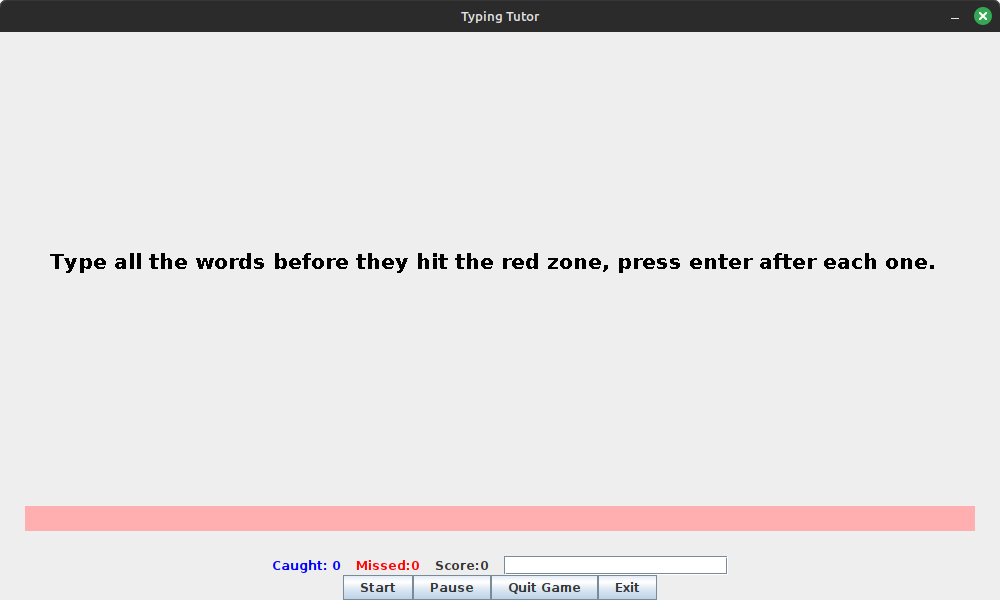
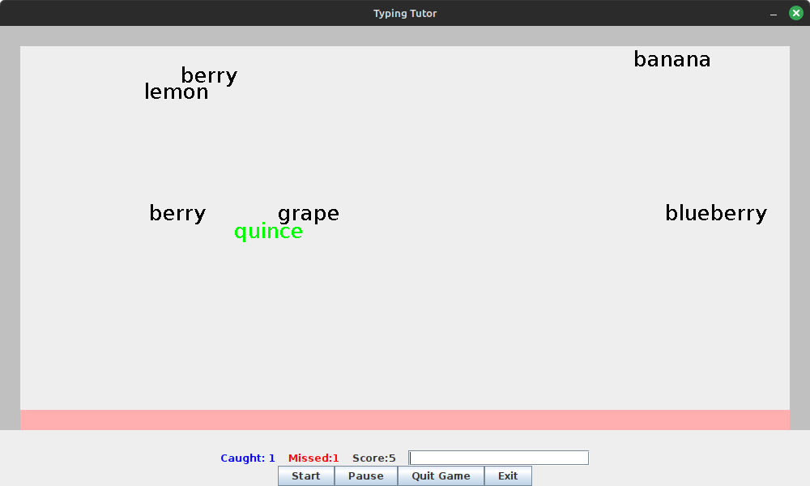

# TypingTutor

## Gameplay

Multi-threaded typing game created with Java. Try to clear all the falling words before they reach the bottom of the screen. The score for each word equals the number of letters in the word.

Special words are highlighted in green. These move horizontally and consume any words they come into contact with. Clear these for extra points

## Installation

Requires Java 7+

Makefile contains instructions to install the game.

Run from source files: `make run`

Generate Java archive: `make compress`

A windows executable is included for easy installation. This can be found at _`exe/basicMode.exe`_